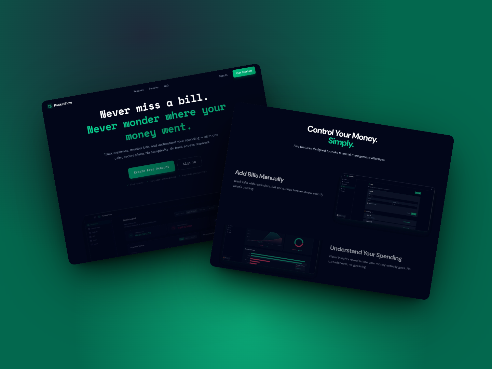
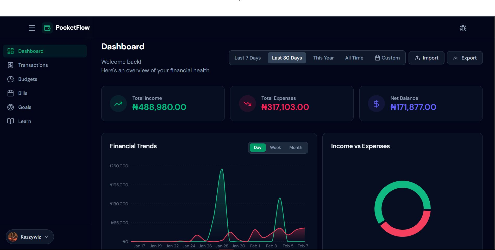
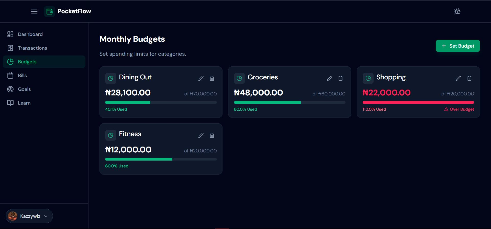
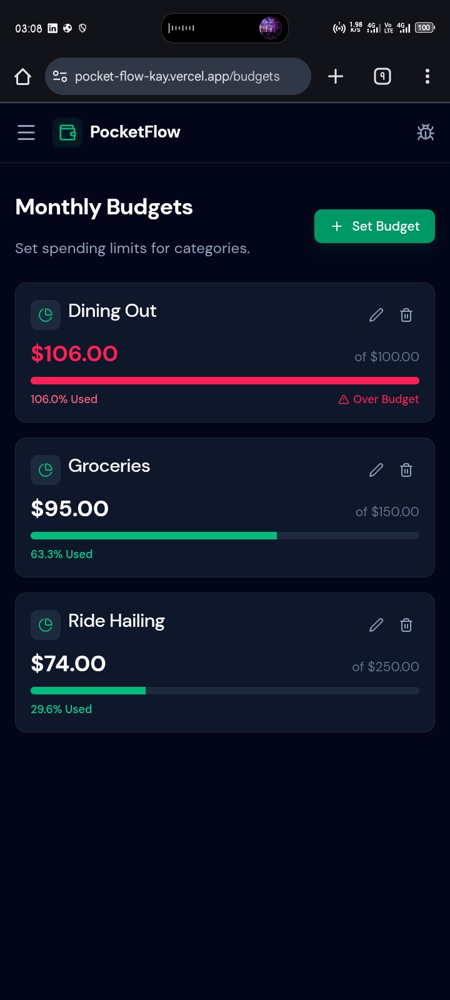

# PocketFlow 💸

> A privacy-first personal finance tracker built with modern web technologies.
>
> **PocketFlow** is a personal finance management application designed to help users track income and expenses, define budgets, monitor financial goals, and gain insights into their spending behavior. Built with reliability and user experience in mind, it features secure authentication, real-time analytics, and data integrity checks. The product prioritizes clarity, data integrity, and user control, with a strong emphasis on reliability, testability, and extensibility.


_[Live URL](https://pocket-flow-kay.vercel.app/) | [Documentation](./docs) | [Report Bug](https://github.com/AyomideKayode/pocketflow/issues)_

---

## 📖 Overview

**PocketFlow** solves the problem of scattered financial data without compromising privacy. Unlike other trackers that require bank credentials, PocketFlow operates on a **manual-first** principle with **smart automation** capabilities.

### Core Value Proposition

- 🔒 **Privacy First**: Your data stays yours. No bank account linking required.
- ⚡ **Simplicity**: Clean, distraction-free interface focused on what matters.
- 🧠 **Smart Insights**: Deterministic algorithms analyze your spending habits.

### Target Users

- Privacy-conscious individuals who want control over their financial data.
- Users who prefer manual tracking or CSV imports over direct bank integration.

---

## ✨ Key Features

- 💸 **Bills & Subscriptions**: Track recurring payments and avoid late fees.
- 📊 **Smart Budget Tracking**: Set monthly limits and get alerted _before_ you overspend.
- 📈 **Spending Insights & Analytics**: Visual analytics for income, expenses, and category breakdowns.
- 🎯 **Financial Goals**: Set savings targets and track your progress.
- 📧 **Email Notifications**: Receive weekly summaries and budget alerts.
- 📂 **CSV Import/Export**: Robust data handling with smart parsing and validation.
- 🎨 **Production-Grade Landing Page**: High-conversion marketing site included.

---

## 📸 Screenshots

|                          Landing Page                           |                          Dashboard                          |
| :-------------------------------------------------------------: | :---------------------------------------------------------: |
|  |  |

|                     Budgets & Goals                     |                      Mobile View                      |
| :-----------------------------------------------------: | :---------------------------------------------------: |
|  |  |

---

## 🛠️ Tech Stack

### Frontend

- **React 19** + **TypeScript** + **Vite**
- **Tailwind CSS** + **Framer Motion**
- **Recharts** for data visualization
- **Lucide React** for icons

### Backend

- **Node.js** + **Express** + **TypeScript**
- **MongoDB** + **Mongoose**
- **Firebase Auth** (Admin SDK)
- **Resend** for email notifications

### Infrastructure

- RESTful API architecture
- JWT-based authentication (Firebase ID Tokens)
- Server-side validation
- Responsive design (mobile-first)

---

## 🏗️ Architecture Overview

The application follows a standard **Client-Server** architecture with a clear separation of concerns.

```mermaid
graph TD
    Client[Client (React + Vite)] <-->|REST API (JSON)| Server[Server (Express + Node.js)]
    Server <-->|Mongoose| DB[(MongoDB)]
    Client <-->|Auth SDK| Firebase[Firebase Auth]
    Server <-->|Admin SDK| Firebase
    Server -->|SMTP/API| Email[Email Service (Resend)]
```

### Key Design Decisions

1. **Manual Tracking**: Deliberate choice to avoid bank APIs (Plaid/Yodlee) for privacy and "active" financial awareness.
2. **Firebase Auth**: Offloads complexity of secure authentication while keeping user data in our own MongoDB.
3. **Server-Side Authority**: All critical logic (bill payments, budget calculations) resides on the server to prevent client-side manipulation.

---

## 🚀 Quick Start

### Prerequisites

- Node.js 18+
- MongoDB (Local or Atlas)
- Firebase Project (Authentication enabled)

### Installation

1. **Clone the repository**

    ```bash
    git clone https://github.com/yourusername/pocketflow.git
    cd pocketflow
    ```

2. **Install dependencies**

    ```bash
    # Install dependencies for both client and server
    npm install
    cd client && npm install
    cd ../server && npm install
    ```

3. **Set up Environment Variables**
    - Copy `.env.example` to `.env` in both `client/` and `server/` directories.
    - Fill in your Firebase and MongoDB credentials.

4. **Run Development Servers**

    ```bash
    # Terminal 1: Server
    cd server
    npm run dev

    # Terminal 2: Client
    cd client
    npm run dev
    ```

---

## 📂 Project Structure

```bash
pocketflow/
├── client/          # React frontend application
├── server/          # Express backend API
├── docs/            # Documentation & specifications
└── README.md        # This file
```

---

## 📅 Development Phases

**Start the Frontend:**

```bash
# In client/ terminal
npm run dev
```

Visit `http://localhost:5173` in your browser.

---

## 🗺️ Development Journey & Roadmap

PocketFlow is being built in distinct phases to ensure stability and code quality.

### ✅ Completed Phases

- **Phase 1: Core Foundation**: Set up React+Vite, Firebase Auth, and basic UI structure. ✅
- **Phase 2A: Data Integrity**: Implemented robust backend validation, `income`/`expense` typing, and bug fixes for environment configurations. ✅
- **Phase 2B: Visualization**: Added Recharts for spending breakdowns and date range filtering. ✅
- **Phase 2C: Trend Analysis & Advanced Reporting**: Completed configurable trend charts (Day/Week/Month), server-side CSV exports, and UI polish (Fonts, Editable Cells). ✅
- **Phase 3: OAuth Integration**: Added Google Sign-In and account linking capabilities. ✅
- **Phase 6: Quality Assurance**: Established Testing Infrastructure (Vitest, Playwright) and CI/CD Pipelines (GitHub Actions). ✅
- **Optimization Sprint**: UX/UI refinements including production favicon, dashboard state synchronization, password visibility toggles, and feedback channels. ✅
- **Phase 4: Budgeting & Goals**: Set monthly limits, savings targets, and added smart notifications. ✅
- **Phase 5: Performance & Optimization**: Implemented lazy loading, database indexing, and robust budget logic. ✅
- **Phase 7: Advanced Features & Personalization**: Added User Profiles, Global Currency Support, and Multi-threshold Budget Notifications. ✅
- **Phase 8: Cloud Media**: Implemented Cloudinary integration for secure, direct-to-cloud profile image uploads. ✅
- **Phase 9A: Foundations (Data Integrity)**: Robust CSV Import with smart parsing (auto-detect delimiters) and data hardening. ✅
- **Phase 9B: Insights (Derived Intelligence)**: Backend analytics pipelines for budget cycle analysis and historical over-budget detection. ✅
- **Phase 10A: Email Infrastructure**: Provider-agnostic email service, template system, and user preference management. ✅
- **Phase 10B: Safe Notifications**: High-confidence budget alerts (100%), goal achievements, and weekly summaries with strict idempotency and historical suppression. ✅
- **Phase 11A: Data Capability Expansion**: Payment method normalization, advanced server-side transaction filtering/sorting/pagination, and improved import flows. ✅
- **Phase 11B: Bills**: Recurring bill tracking and due date awareness. ✅
- **Phase 11C: Learn & Insights**: Added "Learn" page for financial education and "Insights" engine for deterministic, rule-based suggestions (Upcoming Bills, Subscription Check). ✅
- **Landing Page Conversion Optimization**: Implemented high-converting production landing page design with Product Showcase section featuring 5 guided screenshots, trust reinforcement signals, and mobile-responsive layout. ✅

For a detailed history of the development process, challenges, and architectural decisions, see the [Development Blueprint](./POCKETFLOW_DEVELOPMENT_BLUEPRINT.md).

---

## 🧠 Key Architectural Decisions

- **Manual Tracking**: Prioritizes privacy and mindfulness over automation.
- **Firebase Auth**: Industry-standard security for identity management.
- **MongoDB**: Flexible schema for evolving financial data models.
- **Server-Side Authority**: Ensures data integrity and consistent business logic.
- **Deterministic Notifications**: Prevents spam by tracking notification state.

---

## 🤝 Contributing

1. Fork the repository.
2. Create your feature branch (`git checkout -b feature/AmazingFeature`).
3. Commit your changes (`git commit -m 'Add some AmazingFeature'`).
4. Push to the branch (`git push origin feature/AmazingFeature`).
5. Open a Pull Request.

---

## 📄 License

This project is licensed under the ISC License.

---

## 👤 Author

### **Ayomide Kayode**

- Status: Production Ready 🚀
